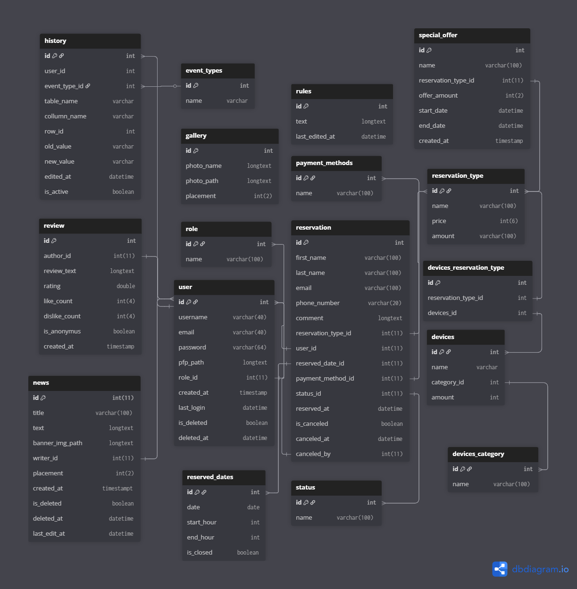

# Pécs Music Society Hivatalos Weboldala 

## A Readme tartalma:
- [Linkek]("")
- [Adatbázis Terv]("")
- [Backend]("")
- [Frontend]("")
- [Elérhetőség]("")

## Linkek: 
- [Web Design](https://www.figma.com/design/fxJIfoxjFc7otjqGpiIQpa/proba_szoba_foglalo?node-id=325-383&t=zvvwznQyB1gXBha0-1)
- [Világos téma szín paletta](")
- [Sötét téma szín paletta](https://www.figma.com/design/iIxDa109pAa3JMpGKGZmu7/Color-wheel-palette-generator--Community-?node-id=0-1&p=f&t=4mIeJTMvo7smcMGR-0)
- [Bootstra dokumentáció](https://material.angular.dev/guide/getting-started)
- [Angular dokumentáció]("")
- [Material dokumentáció](https://material.angular.dev/guide/getting-started)

## Adatbázis:

### Adatbázis terv:

### Tárolt eljárások:
- add_devices
- add_devices_category
- add_dislike
- add_like
- add_news
- add_reservation_type
- add_special_offer
- cancel_reservation
- change_password
- delete_devices
- delete_devices_category
- delete_news
- delete_reservation_type
- get_devices
- get_devices_category
- get_gallery_photos
- get_reservation_by_day
- get_reservation_by_user_id 
- get_reservation_types
- get_reviews
- get_rules
- log_out
- login
- make_reservation
- profil_update
- profile_delete
- registration
- update_devices
- update_devices_category
- update_gallery_photo
- update_news
- update_reservation_type
- update_rules
- write_review

## Backend: 
A spring boot projekt a következő **dependency**-ket tartalmazza: 
- Spring Web
- Spring Data JPA
- MySQL Driver
- Spring Boot Actuator
- Spring Boot DevTools
- Java Mail Sender
- Spring Security

A spring boot projekt a következő **controller**-eket tartalmazza:
- NewsController

## Frontend:
A weblap a következő **componentekre** bontódik fel:
- navbar 
- footer
- home-page
- news-card
- review
    - review-card
- equipments
- price-list
- login-page

A frontend projektben a következő **service**-ek találhatóak meg:

A frontent projektben a következő **model**-ek találhatóak meg:
- user
- newsDetails
- reviewDetails

## Elérhetőség:
- [Github]("")
- [Facebook]("")
- [Email]("")
- [LinkedIn]("")
- [Discord]("")